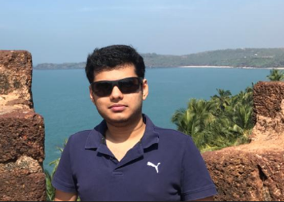

I am Rajas Kakodkar. 

BE '19 @ [PCCE](https://pccegoa.edu.in/).

Software Enginner @ [Persistent Systems](https://twitter.com/Persistentsys). 

I am currently working on Linux, DevOps, CI/CD, Kubernetes, Docker and golang. I am also passionate about Deep Learning and Software programming in general. 

I got hooked onto Deep Learning after attending the amazing [fastai](https://www.fast.ai/) course online. I have done a couple of projects in Deep Learning which I plan to post here.
